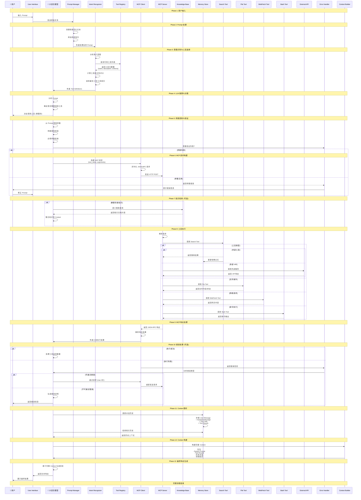
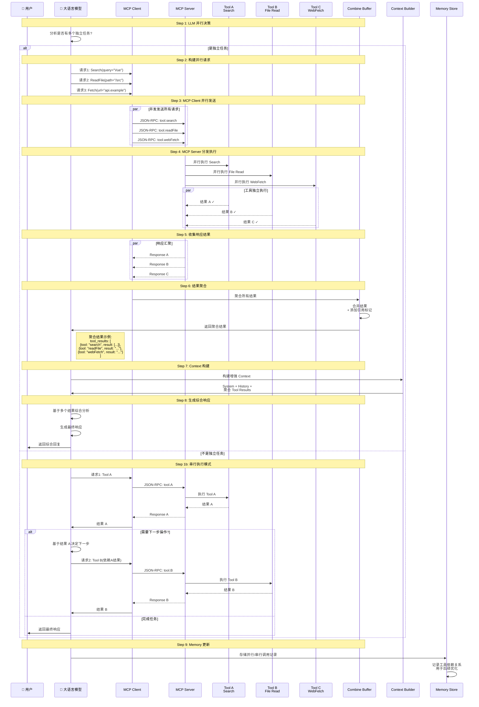

# LLM + MCP 完整架构流程

---

## 流程说明

### Phase 1: 用户输入
- 用户通过 UI 输入自然语言 Prompt

### Phase 2: Prompt 处理
- **Prompt Manager**: 清理文本、添加系统指令、处理模板变量

### Phase 3: 意图识别与工具选择
- **Intent Recognizer**: 分析用户真正想要做什么
- **Tool Registry**: 维护所有可用工具的元数据和 schema

### Phase 4: LLM 推理与决策
- LLM 根据工具描述判断是否需要调用工具

### Phase 5: 参数提取与验证
- 从用户 Prompt 中提取工具所需参数
- 类型校验、必填项检查

### Phase 6: MCP 请求构建
- 构建标准 JSON-RPC 格式请求

### Phase 7: 知识检索 (可选)
- 当需要额外背景知识时，通过 Vector DB 检索

### Phase 8: 工具执行
- 按工具类型分发到具体执行器

### Phase 9: MCP 响应处理
- 解析工具返回结果，传回给 LLM

### Phase 10: 错误处理
- 支持重试机制、错误分类

### Phase 11: Context 累积
- 存储对话历史，支持多轮对话

### Phase 12: Context 构建
- 将所有信息整合为完整的推理 Context

### Phase 13: 最终响应生成
- LLM 生成最终的自然语言回复

---

# 并行执行流程

当 LLM 判断需要同时调用多个独立工具时的并行执行流程。

---

## 并行执行说明

### Step 1: LLM 并行决策
- LLM 分析用户请求，判断是否可以并行执行
- 关键判断：有多个**相互独立**的任务？

### Step 2: 构建并行请求
- 为每个工具单独构建请求参数

### Step 3: MCP Client 并行发送
- 使用 `par` 关键字并发发送所有请求
- 减少等待时间

### Step 4: MCP Server 分发执行
- 服务器端并行调度到各个工具

### Step 5: 收集响应结果
- 等待所有工具完成后汇聚结果

### Step 6: 结果聚合
- **Combine Buffer**: 合并所有结果，添加引用标记
- 标注每个结果来源于哪个工具

### Step 7: Context 构建
- 将聚合结果整合到 LLM Context

### Step 8: 生成综合响应
- LLM 综合分析多个结果，生成统一回复

### Step 9: Memory 更新
- 记录调用模式和依赖关系，用于后续优化

---

## 对比：并行 vs 串行

| 维度 | 并行执行 | 串行执行 |
|------|---------|---------|
| 适用场景 | 独立任务 | 依赖任务 |
| 延迟 | T = max(t1, t2, t3) | T = t1 + t2 + t3 |
| API 调用 | 1 次批量 | N 次单独 |
| 复杂度 | 高 | 低 |
| 错误处理 | 需分别处理 | 链式处理 |