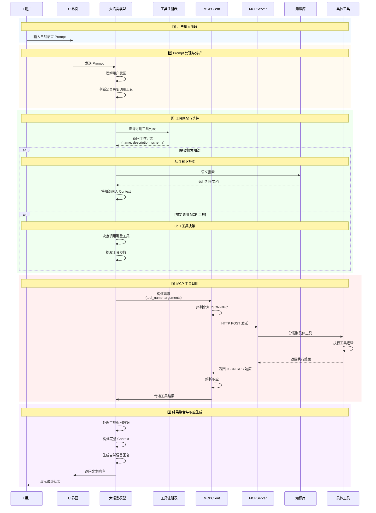

# LLM + MCP 核心流程时序图



---

## 流程总结

```
┌─────────────────────────────────────────────────────────────┐
│  用户输入 ──► LLM分析 ──► 意图识别 ──► 工具匹配 ──►  │
└─────────────────────────────────────────────────────────────┘
                            │
                            ▼
┌─────────────────────────────────────────────────────────────┐
│  ┌──────────┐  ┌──────────┐  ┌──────────┐               │
│  │ 知识检索 │  │ MCP调用  │  │ 返回结果 │               │
│  └──────────┘  └──────────┘  └──────────┘               │
│                            │                               │
│                            ▼                               │
│  ┌─────────────────────────────────────────────────────┐  │
│  │   LLM整合Context ──► 生成最终响应 ──► 用户展示    │  │
│  └────────��────────────────────────────────────────────┘  │
└─────────────────────────────────────────────────────────────┘
```

### 关键节点说明

| 阶段 | 说明 |
|------|------|
| **1. 用户输入** | 用户通过 UI 输入自然语言 Prompt |
| **2. Prompt 分析** | LLM 理解意图，判断是否需要工具 |
| **3. 工具匹配** | 查询工具注册表，选择最优工具；如果需要可同时检索知识库 |
| **4. MCP 调用** | 构建 JSON-RPC 请求，MCP Server 分发执行，返回结果 |
| **5. 响应生成** | LLM 整合所有信息，生成最终自然语言回复 |