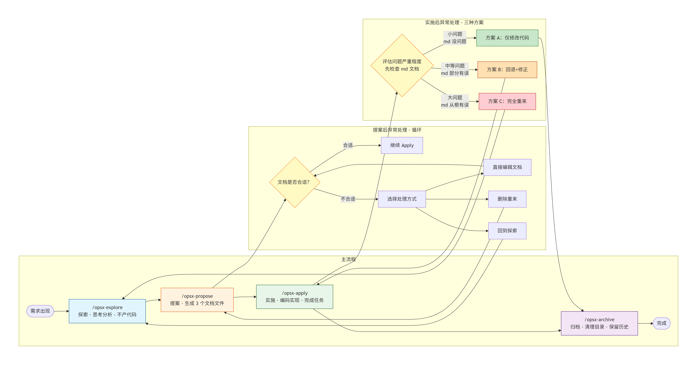
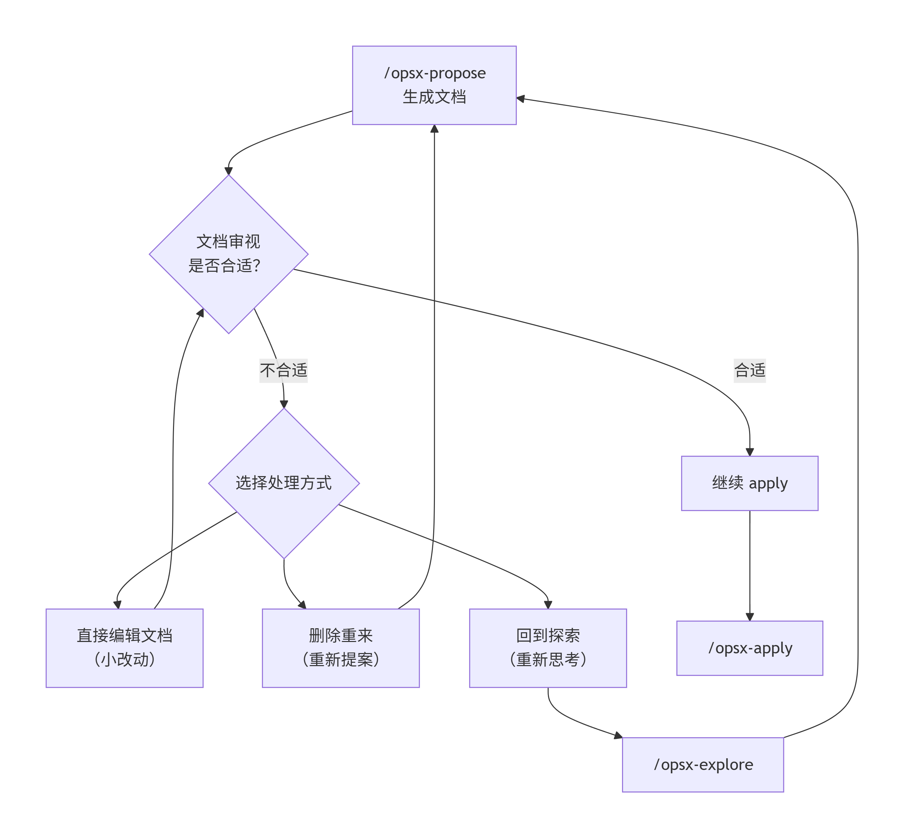
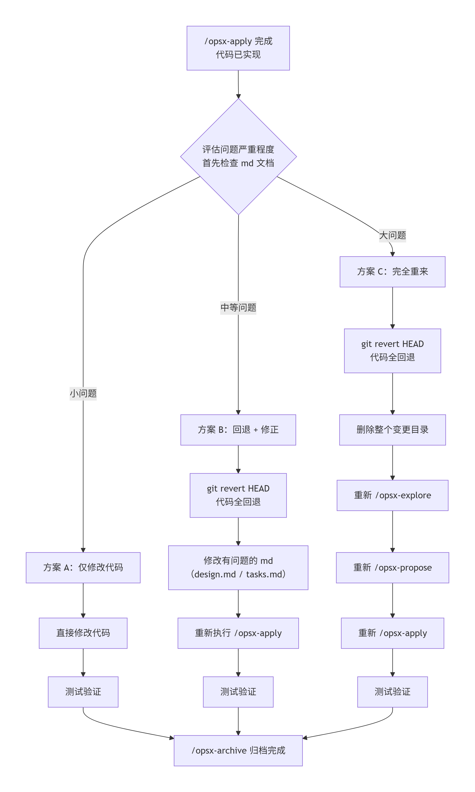

# OpenSpec 完整开发流程详解

## 一、概述

OpenSpec 是一个设计优先、逐步实施的开发工作流，共包含 **4 个核心阶段**：

| 阶段 | 命令 | 核心任务 |
|------|------|----------|
| 1️⃣ 探索 | `/opsx-explore` | 自由思考，分析问题空间 |
| 2️⃣ 提案 | `/opsx-propose` | 生成结构化变更文档 |
| 3️⃣ 实施 | `/opsx-apply` | 按任务列表编码实现 |
| 4️⃣ 归档 | `/opsx-archive` | 清理已完成的变更 |

---

## 二、阶段详解

### 阶段1：探索 — `/opsx-explore`

**命令**：`/opsx-explore`

**目的**：自由思考，分析问题空间

**做什么**：
- 提出澄清性问题、挑战假设
- 调查代码库，绘制架构图
- 比较不同方案，评估权衡
- 识别风险和未知点

**效果**：理清需求，确定最佳方向，**不产生代码**

**运行后改动**：无文件改动，只是对话式探索

---

### 阶段2：提案 — `/opsx-propose`

**命令**：`/opsx-propose <change-name>`

**目的**：创建结构化的变更文档

**示例**：
```bash
/opsx-propose add-user-auth
```

**运行后改动**：创建新目录 `openspec/changes/add-user-auth/`，生成以下文件：

```
openspec/changes/add-user-auth/
├── .openspec.yaml          # 变更元数据
├── proposal.md             # 做什么 & 为什么做
├── design.md               # 技术方案设计
└── tasks.md                # 实现任务列表
```

**效果**：所有设计方案准备就绪，等待实施

---

### 阶段3：实施 — `/opsx-apply`

**命令**：`/opsx-apply` 或 `/opsx-apply <change-name>`

**目的**：按任务列表逐步实现功能

**示例**：
```bash
/opsx-apply add-user-auth
```

**运行后改动**：
- 读取 `proposal.md`、`design.md`、`tasks.md` 等上下文
- 修改项目源代码文件，实现功能
- 逐个完成 `tasks.md` 中的任务
- 每完成一个任务，自动标记为 `- [x]`

**效果**：将设计转化为实际代码，直到所有任务完成

---

### 阶段4：归档 — `/opsx-archive`

**命令**：`/opsx-archive` 或 `/opsx-archive <change-name>`

**目的**：清理已完成的变更

**示例**：
```bash
/opsx-archive add-user-auth
```

**运行后改动**：
- 检查所有工件和任务是否完成
- 如果有 delta specs，提示是否同步到主 specs
- 移动变更目录到 archive

```
openspec/changes/
├── archive/
│   └── 2026-07-14-add-user-auth/   # 归档后的变更
└── (active changes here)
```

**效果**：保持 `openspec/changes/` 目录整洁，保留历史记录

---

## 三、完整流程图 （Mermaid 版）




---

## 四、异常处理分支详解

### 分支1：Propose 后文档不合适（循环流程）




---

### 分支2：Apply 后代码不合适（3种方案）




---

## 五、Apply 后处理方案对比

### 方案 A：仅修改代码

**适用场景**：md文档没问题，只是实现细节有问题

**步骤**：
1. 直接在现有代码上修改
2. 测试验证
3. archive 归档

**代码状态**：保留所有代码，只做代码修改

**文档状态**：无需更新

---

### 方案 B：代码全回退 + 修正md + 重新执行

**适用场景**：md文档部分有问题，需要回退代码并修正文档后重新执行

**步骤**：
1. 完全回退代码（`git revert HEAD` 或 `git reset --hard HEAD~N`）
2. 修改有问题的md文档（design.md、tasks.md 哪些有问题改哪些）
3. 执行 `/opsx-apply` 重新实现
4. 测试验证
5. archive 归档

**代码状态**：全回退，重新执行

**文档状态**：修正有问题的部分，保留正确的部分

---

### 方案 C：完全重来

**适用场景**：md文档从根上就有问题，方向完全错误

**步骤**：
1. 完全回退代码（`git revert HEAD` 或 `git reset --hard HEAD~N`）
2. 删除文档（删除 openspec/changes/xxx/ 目录）
3. 执行 `/opsx-explore` 重新探索
4. 执行 `/opsx-propose` 生成新文档
5. 执行 `/opsx-apply` 重新实现
6. 测试验证
7. archive 归档

**代码状态**：所有代码回退

**文档状态**：删除后重新生成

---

## 六、方案对比总结

| 方案 | 适用场景 | 代码操作 | 文档操作 | 风险程度 |
|------|----------|----------|----------|----------|
| A 仅修改代码 | md文档没问题，只是细节错 | 直接修改 | 无需更新 | 低 |
| B 回退+修正 | md文档部分有问题 | 代码全回退 | 修改有问题的md | 中 |
| C 完全重来 | md文档从根上有问题 | 代码全回退 | 删除文档重新生成 | 高 |

---

## 七、关键原则

### 1. 文档与代码同步

根据问题严重程度选择合适的方案：
- **方案A**：md文档没问题，仅修改代码，无需更新文档
- **方案B**：md文档部分有问题，代码全回退，修改有问题的md后重新执行
- **方案C**：md文档从根上有问题，完全回退，删除文档重新生成

### 2. 循环直到合适

Propose 后的文档审视是一个**循环流程**：
- 不合适 → 处理 → 重新审视 → 还是不合适 → 再处理...
- 直到文档合适才能继续 apply

### 3. 可随时回退

Apply 完成后发现问题，根据md文档是否有问题选择处理方式：
- md文档没问题：仅修改代码（方案A）
- md文档部分有问题：代码全回退，修改有问题的md，重新执行apply（方案B）
- md文档从根上有问题：所有代码回退，文档删除，从explore重新开始（方案C）

---

## 八、一句话总结

> 先想清楚（explore）→ 写清楚（propose）→ 做清楚（apply）→ **发现问题可随时调整，但必须同步更新文档** → 收清楚（archive）
