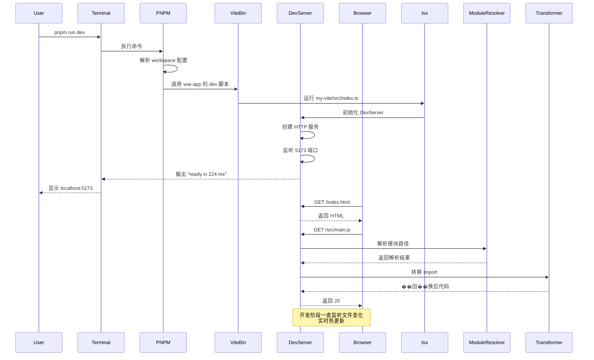

# pnpm run dev 命令执行时序图

## 完整执行流程

```
┌────────────────────────────────────────────────────────────────────────────────────────────────────────────────────────────────┐
│                                                 pnpm run dev 执行时序图                                                         │
└────────────────────────────────────────────────────────────────────────────────────────────────────────────────────────────────┘

     用户                              pnpm                      my-vite                  HTTP Server              浏览器
      │                                 │                          │                         │                     │
      │  1. 输入命令                     │                          │                         │                     │
      │──────────────>│                 │                          │                         │                     │
      │               │  2. 读取 package.json                     │                         │                     │
      │               │─────────────────────────────────────────>│                         │                     │
      │               │                 │  3. 解析 workspaces 配置并定位 vue-app                │                     │
      │               │<──────────────────────────────────────────│                         │                     │
      │               │                 │  4. 执行 vue-app 的 dev 脚本 (my-vite)               │                     │
      │               │───────────────────────────────────────────>│                         │                     │
      │               │                 │                          │  5. 通过 tsx 运行 src/index.ts          │
      │               │                 │                          │────────────────────────────────>│
      │               │                 │                          │  8. 初始化完成        │
      │               │                 │                          │<───────────────────────────────│
      │               │<─────────────────────────────────────────│                         │                     │
      │               │                 │                          │                         │                     │
      │  6. 终端输出                   │                          │                         │                     │
      │<─────────────│                  │                          │                         │                     │
      │                                                                                                          │
      │  ● Vite 输出: "VITE  v1.0.0  ready in 224 ms"                                                       │
      │                                                                                                          │
      │  ● URL: ➜  Local:   http://localhost:5173/                                                             │
      │       ➜  Network: http://192.168.1.5:5173/                                                            │
      │                                                                                                          │
 ━━━━━━━━━━━━━━━━━━━━━━━━━━━━━━━━━━━━━━━━━━━━━━━━━━━━━━━━━━━━━━━━━━━━━━━━━━━━━━━━━━━━━━━━━━━━━━━━━━━━━━━━━━━━━━━━━━━━━━━━━━
      │               │                 │                          │                         │                     │
      │               │                 │                          │  7. 初始化组件                                  │
      │               │                 │                          │──┬──> ModuleResolver                       │
      │               │                 │                          │  │  ├── appRoot = vue-app 目录              │
      │               │                 │                          │  └── 配置文件解析                        │
      │               │                 │                          │──┤──> Transformer                         │
      │               │                 │                          │  │  ├── 初始化缓存                         │
      │               │                 │                          │  └── 注册 watcher                        │
      │               │                 │                          │──┤──> HTTP Server                        │
      │               │                 │                          │     ├── 创建 (handleRequest)             │
      │               │                 │                          │     └── listen(5173)                  │
      │               │                 │                          │                         │                     │
      │               │                 │                          │                         │                     │
      │               │                 │                          │                         │                     │
      ▼               ▼                 ▼                          ▼                         ▼                     ▼


══════════════════════════════════════════════════════════════════════════════════════════════════════════════════════════════════════════════════════
                                     第二阶段: 浏览器请求资源
══════════════════════════════════════════════════════════════════════════════════════════════════════════════════════════════════════════════════════

     用户                              pnpm                      my-vite                  HTTP Server              浏览器
      │                                │                          │                         │                     │
      │                                │                          │                         │  1. 首次访问 http://localhost:5173/
      │                                │                          │                         │<───────────────────────────────────│
      │                                │                          │                         │                      │
      │                                │                          │  2. handleRequest(req, res)        │
      │                                │                          │<─────────────────────────────────│
      │                                │                          │                      │
      │                                │                          │  3. url = '/' -> '/index.html'
      │                                │                          │───>│
      │                                │                          │                      │
      │                                │                          │  4. serveFile(res, vue-app/index.html)
      │                                │                          │───>│
      │                                │                          │                      │
      │                                │                          │  5. 是 .html 文件 → 直接读取
      │                                │                          │─> fs.readFile() ─>│
      │                                │                          │<─────────────────────────────────│
      │                                │                          │                      │
      │                                │                          │  6. 返回 HTML 内容
      │                                │                          │─────────────────────────────────>│
      │                                │                          │                         │  7. 响应 200 OK
      │                                │                          │                         │<────────────────────────────────│
      │                                │                          │                         │                      │
 ━━━━━━━━━━━━━━━━━━━━━━━━━━━━━━━━━━━━━━━━━━━━━━━━━━━━━━━━━━━━━━━━━━━━━━━━━━━━━━━━━━━━━━━━━━━━━━━━━━━━━━━━━━━━━━━━━━━━━━━━━━━━━━━━━━━━━━━━━━

     浏览器收到 index.html，发现内嵌 <script> 标签，请求 /src/main.js
      │
      │                                │                          │                         │  8. GET /src/main.js
      │                                │                          │                         │<───────────────────────────────────│
      │                                │                          │                         │
      │                                │                          │  9. handleRequest()              │
      │                                │                          │<─────────────────────────────────│
      │                                │                          │
      │                                │                          │  10. serveFile() 检测到是 .js 文件
      │                                │                          │───>│
      │                                │                          │
      │                                │                          │  11. transformFile(path)
      │                                │                          │───>│
      │                                │                          │
      │                                │                          │  12. transformer.transform()
      │                                │                          │───>│
      │                                │                          │
      │                                │                          │  13. ModuleResolver.resolve() 解析导入路径
      │                                │                          │├──> 处理相对导入 (./*.js)
      │                                │                          │├──> 处理 node_modules
      │                                │                          │└──> 返回解析后的文件路径
      │                                │                          │<───│
      │                                │                          │
      │                                │                          │  14. Transformer 处理 import 语句
      │                                │                          │    - 将 import A from './pages/home.js'
      │                                │                          │    - 转换为 import A from '/src/pages/home.js'
      │                                │                          │
      │                                │                          │  15. 返回转换后的 JS 代码
      │                                │                          │─────────────────────────────────>│
      │                                │                          │                         │  16. 响应 200 OK + 转换后代码
      │                                │                          │<────────────────────────────────│
      │                                │                          │                         │
      ▼                                ▼                         ▼                         ▼                     ▼


══════════════════════════════════════════════════════════════════════════════════════════════════════════════════════════════════════════════════════
                                     第三阶段: 热更新监听
══════════════════════════════════════════════════════════════════════════════════════════════════════════════════════════════════════════════════════

     用户                              pnpm                      my-vite                  HTTP Server              浏览器
      │                                │                          │                         │                     │
      │  开发者修改源文件                                                          │
      │  编辑 src/pages/home.js                                                        │
      │──────────────────────────────>│                          │                         │                     │
      │                                │                          │                         │                     │
      │               文件变化 ───────────────────────────────────────────────────────────>│
      │                                │                          │                      │
      │                                │                          │  chokidar 监听器检测到变化 │
      │                                │                          │<─────────────────────────────────│
      │                                │                          │
      │                                │                          │  重新调用 transformFile(path)
      │                                │                          │───>│
      │                                │                          │
      │                                │                          │  更新缓存
      │                                │                          │───>│
      │                                │                          │
      │                                │                          │  WebSocket 或轮询通知浏览器
      │                                │                          │────────────────────────────────>│
      │                                │                          │                         │
      │                                │                          │  HMR 更新消息
      │                                │                          │<────────────────────────────────│
      │                                │                          │                         │
      │  浏览器无刷新更新 DOM                                                      │
      │<───────────────────────────────────────────────────────────────────────────│
      │                                                                                                          │
      ▼                                       ▼                         ▼                         ▼                     ▼
```

## 详细步骤分解

### 第一阶段: 命令启动

| 步骤 | 操作 | 说明 |
|------|------|------|
| 1 | `pnpm run dev` | 用户在根目录执行命令 |
| 2 | pnpm 读取配置 | 解析 `package.json` 中的 `scripts.dev` |
| 3 | 定位包 | 根据 `--filter vue-app` 找到 `packages/vue-app` |
| 4 | 执行脚本 | 进入 vue-app 目录，执行 `my-vite` 命令 |
| 5 | 链接解析 | 在 `node_modules/.bin` 中找到 `my-vite` 可执行文件 |
| 6 | 运行 TSX | 使用 `tsx` 解释器运行 `my-vite/src/index.ts` |
| 7 | 初始化 | 创建 HTTP 服务器，监听端口 5173 |
| 8 | 启动完成 | 终端输出 `http://localhost:5173` |

### 第二阶段: 浏览器请求

| 步骤 | 请求 | 处理逻辑 |
|------|------|----------|
| 1 | GET / | 直接返回 `vue-app/index.html` |
| 2 | GET /src/main.js | → `transformer.transform()` |
| 3 | 解析导入 | 通过 `ModuleResolver` 解析依赖 |
| 4 | 路径转换 | 将 `./pages/home` 转换为 `/src/pages/home` |
| 5 | 返回响应 | 发送转换后的代码到浏览器 |

### 第三阶段: 热更新

| 步骤 | 操作 | 说明 |
|------|------|------|
| 1 | 文件变更 | 开发者在编辑器中保存文件 |
| 2 | 监听触发 | `chokidar` 检测到 `home.js` 变化 |
| 3 | 清空缓存 | 删除该文件的缓存记录 |
| 4 | 重新编译 | 再次调用 `transformer.transform()` |
| 5 | 推送更新 | 通过 WebSocket 发送更新消息 |
| 6 | 局部刷新 | 浏览器执行 HMR 脚手架更新 DOM |

## 架构对应关系

```
┌─────────────────────────────────────────────────────────────────────────────────────────────────┐
│                              架构层级                                    │
├─────────────────────────────────────────────────────────────────────────────────────────────────┤
│                                                                         │
│   CLI Layer         pnpm run dev ──> pnpm ──> @pnpm/cli/resolve-deps   │
│                            │                                            │
│                            ▼                                            │
│   Script Layer     my-vite (bin) ──> tsx src/index.ts                    │
│                            │                                            │
│                            ▼                                            │
│   Core Layer      ┌──────────────────────────────────────┐             │
│                  │  DevServer                          │             │
│                  │  ├─ ModuleResolver                  │             │
│                  │  ├─ Transformer                      │             │
│                  │  └─ HttpServer (Node.js)             │             │
│                  └──────────────────────────────────────┘             │
│                            │                                            │
│                            ▼                                            │
│   Plugin Layer    ┌──────────────────────────────────────┐             │
│                  │  内置插件                            │             │
│                  │  ├─ vue-plugin                      │             │
│                  │  ├─ esbuild transform              │             │
│                  │  └─ hmr-plugin                     │             │
│                  └──────────────────────────────────────┘             │
│                                                                         │
│   Browser Layer   浏览器  ←─ HTTP/WebSocket ──>  my-vite server            │
│                                                                         │
└─────────────────────────────────────────────────────────────────────────────────────────────────┘
```

## Vite 对比说明

真实 Vite 在同样场景下的处理：

| 特性 | 本项目 (my-vite) | 真实 Vite |
|------|-----------------|-----------|
| HTTP 服务器 | Node.js 原生 http | Koa + Connect |
| 模块解析 | 手写 ModuleResolver | es-module-lexer |
| 代码转换 | 正则替换 + import transform | esbuild |
| Vue 支持 | 基础 script 提取 | @vitejs/plugin-vue |
| HMR | 无 | 完整 WebSocket HMR |
| 构建 | 无 | esbuild 打包生产 |

## 时序图总结

