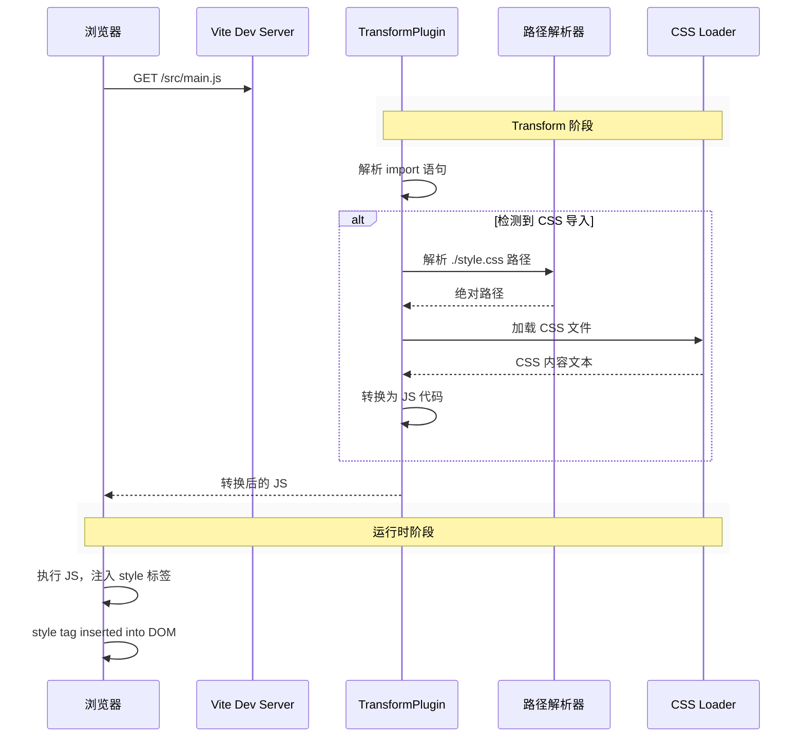
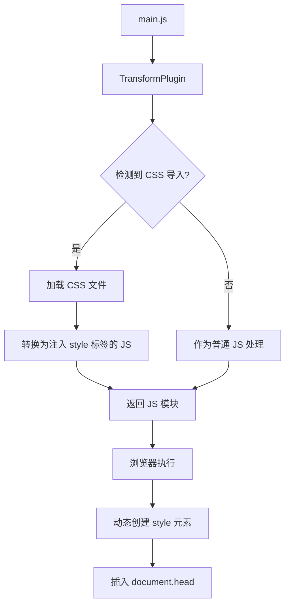

# CSS 模块导入处理原理

## 问题背景

在 JavaScript 模块中使用 `import './style.css'` 是 Vite（及类似构建工具）支持的特性。但浏览器并不支持直接加载 CSS 作为 ES 模块，这需要构建工具在后台处理。

## 处理流程



## 核心实现

### 1. 检测 CSS 导入语句

Vite 使用正则表达式检测 `import` 语句：

```javascript
// 正则匹配 import xxx from 'xxx.css'
const cssImportRE = /import\s+.*?from\s+['"](.*?\.css)['"]/g

// 或动态导入 import('xxx.css')
const cssDynamicImportRE = /import\s*\(['"](.*?\.css)['"]\)/
```

### 2. 路径解析

与其他 JS 模块一样，需要解析相对路径为绝对路径：

```javascript
function resolve(id, importer) {
  if (id.startsWith('.')) {
    // 相对于 importer 进行解析
    const dir = path.dirname(importer)
    return path.resolve(dir, id)
  }
}
```

### 3. CSS 转换为 JS 代码

这是关键步骤。将 CSS 内容转换为可执行的 JS：

```javascript
function transformCSS(cssContent) {
  // 转义 CSS 中的特殊字符
  const escapedCSS = cssContent
    .replace(/\\/g, '\\\\')
    .replace(/'/g, "\\'")
    .replace(/\n/g, '\\n')
    .replace(/\r/g, '\\r')
  
  // 生成注入 style 标签的 JS 代码
  return `
    import { injectStylesIntoStyleTag } from '/@vite-css'
    window.__vite_css = ${escapedCSS}
    injectStylesIntoStyleTag(window.__vite_css)
  `
}

// 或者使用更规范的 export 方式
function transformCSSModule(code) {
  return `
    var __vite_css_inject_chunk__ = ${JSON.stringify(code)};
    document.head.appendChild(Object.assign(document.createElement("style"), {
      textContent: __vite_css_inject_chunk__
    }));
  `
}
```

### 4. HTML 注入 style 标签（另一种方案）

对于主入口文件，Vite 也可以在 HTML 模板中直接注入：

```javascript
function injectCSSToHTML(html, cssFiles) {
  const styleTags = cssFiles
    .map(css => `<link rel="stylesheet" href="${css}">`)
    .join('\n')
  
  return html.replace(
    '</head>',
    `${styleTags}</head>`
  )
}
```

## 完整示例实现

### my-vite 改造版本

```typescript
// transform.ts 添加 CSS 处理

const CSS_IMPORT_RE = /import\s+.*?from\s+['"]([^'"]+\.css)['"]/g
const CSS_DYNAMIC_RE = /import\s*\(['"]([^'"]+\.css)['"])\)/g

export class Transformer {
  // ...
  
  async transformJS(filePath: string, code: string): Promise<TransformResult> {
    let deps: string[] = []
    let cssDeps: string[] = []
    
    // 替换 CSS 导入
    const replaced = code
      // 静态导入: import './style.css'
      .replace(CSS_IMPORT_RE, (match, imp) => {
        const resolved = this.resolver.resolve(imp, filePath)
        if (resolved && !resolved.isExternal) {
          cssDeps.push(resolved.resolved)
        }
        // CSS 导出为空模块，实际内容通过 side effect 注入
        return ''
      })
      // 动态导入: import('./style.css')
      .replace(CSS_DYNAMIC_RE, (match, imp) => {
        const resolved = this.resolver.resolve(imp, filePath)
        if (resolved && !resolved.resolved) {
          cssDeps.push(resolved.resolved)
        }
        return `(() => {})()`
      })
    
    return { code: replaced, deps: [...deps, ...cssDeps], cssDeps }
  }
}
```

### index.ts 添加 CSS 服务

```typescript
// index.ts

async function transformFile(filePath: string): Promise<{ content: string; contentType: string }> {
  const code = fs.readFileSync(filePath, 'utf-8')
  const ext = path.extname(filePath)
  
  // CSS 文件特殊处理
  if (ext === '.css') {
    // 直接返回内容，Content-Type 为 JavaScript，让浏览器执行
    const jsCode = `
      (function() {
        var style = document.createElement('style')
        style.textContent = ${JSON.stringify(code)}
        document.head.appendChild(style)
      })()
    `
    return { content: jsCode, contentType: 'application/javascript' }
  }
  
  // 其他文件...
}
```

### 处理流程图



## 关键要点总结

| 步骤 | 说明 |
|------|------|
| 1. 检测 | 使用正则匹配 `import '*.css'` 语句 |
| 2. 解析 | 解析 CSS 文件的绝对路径 |
| 3. 转换 | 将 CSS 内容转为 `document.createElement('style')` 的 JS 代码 |
| 4. 注入 | 浏览器执行 JS，动态插入 style 标签到 DOM |
| 5. HMR | CSS 变更时只更新 style 标签内容，不刷新页面 |

## 与其他资源的区别

```javascript
// JS 模块 - 转换后直接执行
import('./app.js')

// CSS 模块 - 转换为注入 style 标签的 JS
import('./style.css')

// JSON 模块 - 转换为 export default 对象
import data from('./data.json')

// 图片模块 - 转换为 URL 字符串
import img from('./img.png')
```

## HMR 支持

CSS 导入的一个优势是支持热更新：

```javascript
// Vite 检测到 CSS 文件变化
watcher.on('change', (file) => {
  if (file.endsWith('.css')) {
    // 只推送新的 CSS，不刷新页面
    ws.send({
      type: 'css-update',
      css: newContent
    })
  }
})

// 浏览器端
hot.on('css-update', ({ css }) => {
  // 更新已有的 style 标签
  const style = document.querySelector('style[data-vite-css]')
  style.textContent = css
})
```

## 参考源码

- Vite 核心: `packages/vite/src/node/plugins/css.ts`
- Transforms: `packages/vite/src/node/plugins/transform.ts`
- 插件 hook: `enforce: 'post'` 执行顺序