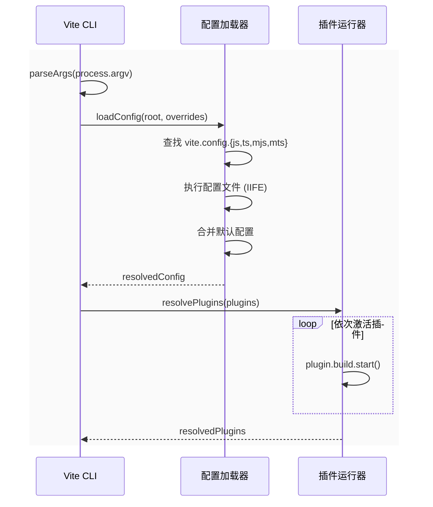
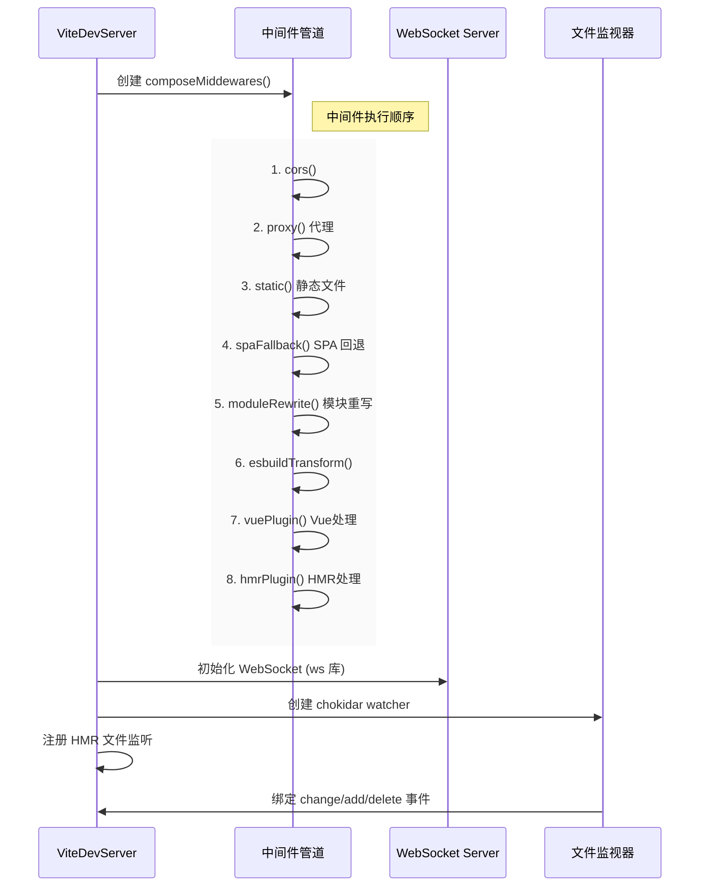
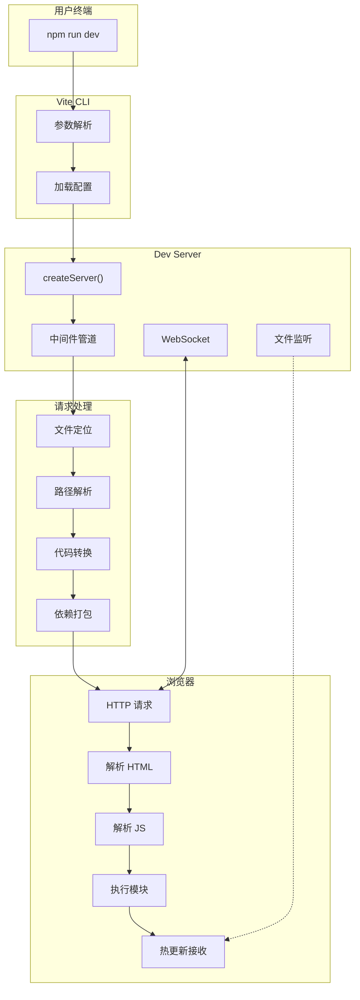
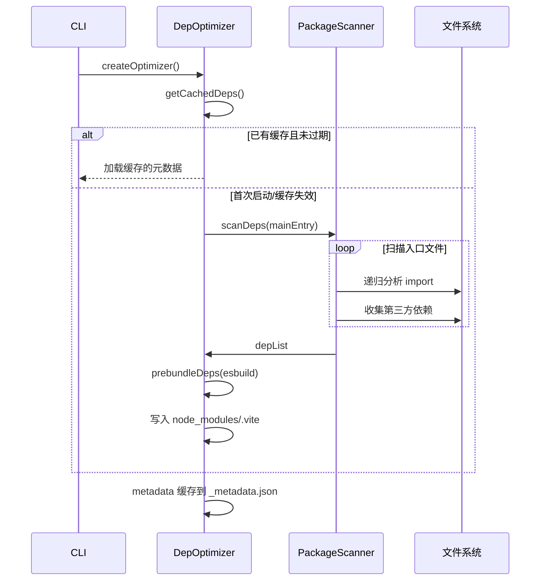
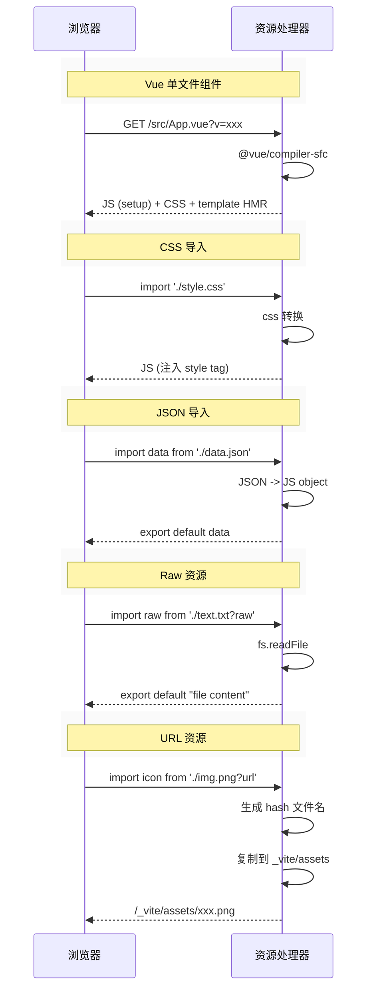

# Vite 开发服务器启动与服务流程时序图

## 完整流程概览

```mermaid
sequenceDiagram
    participant User as 用户 (终端)
    participant CLI as Vite CLI
    participant Config as 配置文件<br/>vite.config.js
    participant Server as ViteDevServer
    participant Plugin as 插件系统
    participant HTTP as HTTP Server<br/>(http.createServer)
    participant Browser as 浏览器
    participant Transform as 模块转换器
    participant Resolve as 依赖解析器

    rect rgb(250, 250, 250)
        Note over User,Browser: === 阶段一：启动准备 ===
        User->>CLI: npm run dev / vite
        CLI->>CLI: 解析命令行参数 (port, host, open...)
        CLI->>Config: 加载 vite.config.js
        Config-->>CLI: 返回配置对象
        
        Note over User,Browser: === 阶段二：服务创建 ===
        CLI->>Server: createServer(config)
        Server->>Server: 创建 middleware 数组
        Server->>Server: 初始化 pluginContainer
        Server->>Plugin: 调用 configPlugins'
        Plugin-->>Server: 返回已激活的插件列表
        
        Note over User,Browser: === 阶段三：HTTP 服务启动 ===
        Server->>HTTP: http.createServer(app)
        HTTP->>HTTP: listen(port, host)
        HTTP-->>Server: 服务器启动成功
        Server-->>User: ✓ Local: http://localhost:5173/
        Server-->>User: ✓ Network: http://192.168.x.x:5173/
    end
    

    rect rgb(250, 250, 250)
        Note over User,Browser: === 阶段四：浏览器首次访问 (index.html) ===
        Browser->>Server: GET /
        Server->>Server: 查找 index.html
        
        alt 是否有自定义 HTML 入口
            Server-->>Server: 读取自定义 index.html
        else 默认查找
            Server-->>Server: 查找项目根目录 index.html
        end
        
        Server-->>Browser: 返回 HTML (含 script type="module")
        
        rect rgb(250, 250, 250)
            Note over User,Browser: === 阶段五：浏览器请求 main.js ===
            Browser->>Server: GET /src/main.js
            Server->>Transform: transformRequest(url)
            
            alt 文件是否需转换
                Transform->>Transform: 检查缓存
                
                alt 有缓存
                    Transform-->>Server: 返回缓存结果
                else 无缓存
                    
                    rect rgb(250, 250, 250)
                        Note over User,Browser: === 阶段六：模块解析与转换 ===
                        Transform->>Resolve: resolveId(id)
                        
                        Resolve->>Resolve: 查询 moduleGraph
                        
                        alt 内置模块 (vue, react)
                            Resolve-->>Transform: 内置模块标记
                        else node_modules
                            Resolve-->>Transform: 绝对路径
                        else 本地模块
                            Resolve-->>Transform: 解析后的相对路径
                        end
                        
                        Transform->>Plugin: 调用 transform 钩子
                        Plugin-->>Transform: 返回转换后的代码
                        
                        Transform->>Transform: 生成 sourcemap
                        Transform->>Transform: 加入缓存
                        Transform-->>Server: 返回结果
                    end
                end
                
                Server-->>Browser: 返回转换后的 JS
            end
        end
        
        rect rgb(250, 250, 250)
            Note over User,Browser: === 阶段七：依赖预构建 (首次 Import) ===
            Browser->>Server: GET /node_modules/vue/dist/vue.esm.js
            Server->>Server: checkImports()
            
            alt 第三方模块首次导入
                Server->>Resolve: scanImports(deps)
                
                loop 遍历依赖
                    Resolve->>Resolve: 递归分析 import 语句
                end
                
                Resolve->>Server: 返回预构建清单
                
                Server->>Transform: preBundleDeps()
                
                loop 处理每个依赖
                    Transform->>Transform: esbuild 打包
                    Transform->>Transform: 输出到 node_modules/.vite
                end
                
                Server-->>Browser: 返回预构建后的代码
            else 已预构建
                Server-->>Server: 读取 .vite 缓存
                Server-->>Browser: 返回缓存内容
            end
        end
        
        rect rgb(250, 250, 250)
            Note over User,Browser: === 阶段八：HMR 热更新 (文件变更时) ===
            activate Server
            Server->>Server: watcher.on("change", file)
            
            Server->>Server: analyzeChain
            
            alt CSS 文件变更
                Server->>Server: handleCSSChange()
                Server->>Browser: WebSocket 推送 css-update
            else JS/Vue 文件变更
                Server->>Transform: transformFromAst()
                
                Server->>Server: propagate()
                
                Server->>Browser: WebSocket 推送 full-reload
            end
            
            Server-->>Browser: HMR 消息
            Browser->>Browser: 更新模块 / 重载页面
        end
    end
```



---

### 阶段十：模块图谱维护 (ModuleGraph)

```mermaid
sequenceDiagram
    participant Graph as ModuleGraph
    participant Resolve as Resolver
    participant Transform as Transform
    participant Cache as 缓存
    
    rect rgb(250, 250, 250)
        Note over Graph,Cache: 模块关系追踪
    end
    
    Resolve->>Graph: resolveId('/src/app.js')
    
    alt 已有节点
        Graph-->>Resolve: 返回现有模块节点
    else 新模块
        
        Graph->>Graph: createModule('')
        
        Graph->>Resolve: url + pos
        
        Resolve-->>Graph: 绝对路径 + 真实路径
        
        Graph->>Graph: 设置 meta 信息
    end
    
    note right of Graph: 保存 importer→imported 关系
    
    ---
    
    Transform->>Graph: getModule('/src/app.js')
    
    alt 获取转换后的模块
        Transform->>Transform: 解析 import 语句
        Transform->>Graph: updateModule(graphNode, deps)
        
        Graph->>Graph: 添加边关系
    end
    
    note right of Graph: DAG（有向无环图）
```

**数据结构：**
- `Map<string, ModuleNode>` - 所有模块
- `ModuleNode.importer` - 导入者
- `ModuleNode.importers` - 被哪些模块导入
- `ModuleNode.transformResult` - 转换结果缓存

---

### 阶段十一：插件 Hook 执行时机

```mermaid
sequenceDiagram
    participant Plugin as 插件系统
    participant Hooks as Hook 执行器
    
    rect rgb(250, 250, 250)
        Note over Plugin,Hooks: config 阶段（启动时）
    end
    
    CLI->>Plugin: config('', {})
    Plugin->>Plugin: config()
    
    ---
    
    rect rgb(250, 250, 250)
        Note over Plugin,Hooks: configureServer 阶段
    end
    
    Server->>Plugin: configureServer(server)
    Plugin->>Plugin: 注册中间件
    
    ---
    
    rect rgb(250, 250, 250)
        Note over Plugin,Hooks: resolveId 阶段（每个模块）
    end
    
    Transform->>Plugin: resolveId(source, importer)
    Plugin->>Plugin: 返回resolved
    
    ---
    
    rect rgb(250, 250, 250)
        Note over Plugin,Hooks: transform 阶段（代码转换）
    end
    
    Transform->>Plugin: transform(code, id)
    Plugin->>Plugin: 返回转换结果
    
    ---
    
    rect rgb(250, 250, 250)
        Note over Plugin,Hooks: load 阶段（虚拟模块）
    end
    
    Transform->>Plugin: load(id)
    Plugin->>Plugin: 返回虚拟模块内容
    
    ---
    
    rect rgb(250, 250, 250)
        Note over Plugin,Hooks: handleHotUpdate 阶段
    end
    
    Watcher->>Plugin: handleHotUpdate({modules})
    Plugin->>Plugin: 自定义 HMR 处理
```

**关键 Hook 顺序：**
1. `config` - 构建配置
2. `configResolved` - 配置完成
3. `configureServer` - 注册中间件
4. `configurePreviewServer` - 预览服务器
5. `buildStart` - 开始构建
6. `resolveId` - 路径解析（优先）
7. `load` - 加载模块
8. `transform` - 代码转换
9. `handleHotUpdate` - HMR 处理
10. `closeBundle` - 构建结束

---

### 阶段十二：WebSocket HMR 协议

```mermaid
sequenceDiagram
    participant Server as WS Server
    participant Protocol as HMR Protocol
    participant Client as HMR Client
    participant App as 业务 App
    
    rect rgb(250, 250, 250)
        Note over Server,Protocol: 连接建立
    end
    
    Server->>Protocol: createWebSocketServer()
    Protocol->>Protocol: 使用 ws 库
    
    Client->>Protocol: new WebSocket('ws://localhost:5173')
    Protocol->>Protocol: 握手 + 心跳
    
    Server->>Client: 'connected'
    
    ---
    
    rect rgb(250, 250, 250)
        Note over Server,Protocol: 消息类型
    end
    
    Server->>Protocol: 构建消息 payload
    
    alt 错误消息
        Protocol->>Client: { type: 'error', err }
    end
    
    alt 静态日志
        Protocol->>Client: { type: 'static', paths }
    end
    
    alt 自定义消息
        Protocol->>Client: { type: 'custom', event, data }
    end
    
    alt 更新消息（包括 Vue）
        Protocol->>Client: { type: 'update', updates [...] }
        
        loop updates
            Client->>App: hotDispatch({ event, data })
            
            alt 有 dispose
                App->>App: dispose()
            end
            
            alt 有 accept
                App->>App: accept()
            end
        end
    end
    
    alt 全量刷新
        Protocol->>Client: { type: 'full-reload', path }
        
        Client->>App: location.reload()
    end
```

---

## 分阶段详解

### 阶段一：启动准备



**关键点：**
- 命令行参数优先级最高：`vite --port 3000`
- 配置文件支持 `.ts` / `.mjs` / `.mts`
- 插件按顺序激活，执行 `config` → `build` 钩子

---

### 阶段二：服务器创建



**中间件执行顺序：**
1. `cors` - CORS 头处理
2. `proxy` - API 代理
3. `servePublic` - public 目录静态资源
4. `transformRequest` - 模块转换
5. `serveStatic` - 静态资源 fallback
6. `hmr` - 热更新处理

---

### 阶段三：模块转换详解

```mermaid
sequenceDiagram
    participant Transform as TransformPlugin
    participant Parser as AST 解析器
    participant Resolver as 路径解析器
    participant Esbuild as esbuild
    participant Cache as 内存缓存
    
    Browser->>Transform: GET /src/App.vue
    
    Transform->>Parser: parse(ast)
    Parser->>Parser: 分析 &lt;script&gt; 部分
    
    alt Vue 单文件组件
        Parser->>Parser: @vue/compiler-sfc
        Parser-->>Transform: 分离 script/style/template
        Transform->>Transform: 分别处理各块
    end
    
    Transform->>Transform: 检查缓存
    
    alt 有缓存且未过期
        Transform-->>Browser: 304 Not Modified
    else 无缓存
    
        Transform->>Resolver: resolveId(importPath)
        
        alt 内置模块
            Resolver-->>Transform: /@vite嵌入模块
        else node_modules
            Resolver->>Resolver: 查找 node_modules/
            Resolver-->>Transform: 绝对路径
        else 相对路径
            Resolver->>Resolver: 拼接 baseUrl
            Resolver-->>Transform: 绝对路径
        end
        
        Transform->>Esbuild: esbuild.transform(code)
        
        Esbuild-->>Transform: 转换后的 JS
        
        Transform->>Cache: 存入结果
        Transform-->>Browser: 200 OK + 转换后代码
    end
```

---

### 阶段四：依赖预构建

```mermaid
sequenceDiagram
    participant Scanner as DepScanner
    participant Crawler as AST 爬虫
    participant Bundler as esbuild 打包器
    participant CacheDir as node_modules/.vite
    
    Browser->>Scanner: import 'vue'
    
    Scanner->>Scanner: isOptimizedDeps()
    
    alt 已在缓存中
        Scanner-->>Browser: 返回缓存路径
    else 首次导入
        
        Scanner->>Crawler: crawlImport(mainJs)
        
        loop 递归扫描所有 import
            Crawler->>Crawler: parseImports(ast)
            Crawler->>Scanner: 发现 dep: ['vue', 'vue-router']
        end
        
        Scanner->>Bundler: bundleDeps(deps)
        
        loop 每个依赖
            Bundler->>Bundler: esbuild.build({
                entry: pkg.module,
                bundle: true,
                format: 'esm',
                external: ['vue']
            })
            
            Bundler->>CacheDir: 输出 xxx.js + xxx.js.map
        end
        
        CacheDir-->>Scanner: 预构建完成
        Scanner-->>Browser: 分包优化后的代码
    end
```

---

### 阶段五：HMR 热更新

```mermaid
sequenceDiagram
    participant Watcher as chokidar
    participant HMR as HMRPlugin
    participant Client as HMR Client
    participant App as Vue/React App
    
    Watcher->>HMR: file change event
    
    HMR->>HMR: getAffectedModules(file)
    
    HMR->>HMR: propagateUpdate()
    
    rect rgb(250, 250, 250)
        Note right of HMR: 计算受影响模块链
    end
    
    alt 需要重载
        HMR->>Client: {'type': 'full-reload'}
        Client->>App: location.reload()
    else 局部更新
        HMR->>Client: {
            'type': 'update',
            'updates': [{模块, hotmap}]
        }
        
        Client->>App: 替换新模块代码
        
        rect rgb(250, 250, 250)
            Note right of App: 执行 dispose/create/accept 生命周期
        end
    end
    
    alt CSS 更新
        HMR->>Client: {style tag update}
        Client->>App: style tag innerHTML = newCSS
    end
```

---

## 数据流向总览



---

### 阶段六：依赖预扫描与缓存 (启动时预优化)



**关键点：**
- 启动时自动扫描 `dependencies` 中的模块
- `_metadata.json` 记录预构建信息，用于缓存验证
- 可通过 `optimizeDeps.include/exclude` 手动控制

---

### 阶段七：静态资源与代理中间件

```mermaid
sequenceDiagram
    participant Browser as 浏览器
    participant Middle as 中间件管道
    participant Public as public 目录
    participant Proxy as 代理服务器
    
    rect rgb(250, 250, 250)
        Note over Browser,Proxy: 静态资源处理
    end
    
    Browser->>Middle: GET /favicon.ico
    
    alt public/favicon.ico 存在
        Middle->>Public: 读取文件
        Middle-->>Browser: 200 OK + mime-type
    else 不存在
        Middle->>Middle: next()
    end
    
    ---
    
    Browser->>Middle: GET /api/users
    
    alt 配置了 proxy
        Middle->>Proxy: http-proxy 转发
        Proxy->>Backend: http://backend/api/users
        Backend-->>Proxy: 响应
        Proxy-->>Middle: 代理响应
        Middle-->>Browser: 代理结果
    else 未配置
        Middle->>Middle: next() -> 404
    end
```

**中间件配置顺序：**
1. `cors` - 跨域头
2. `proxy` - API 代理 (`server.proxy`)
3. `servePublic` - public 目录 (`publicDir`)
4. `moduleRewrite` - 模块路径重写 (`/@vite/env`)
5. `transformRequest` - 代码转换
6. `serveStatic` - 静态资源 fallback

---

### 阶段八：各类资源请求处理



**资源查询参数：**
- `?raw` - 导出原始字符串
- `?url` - 导出文件 URL
- `?inline` - 内联 Base64
- `?v=` - 缓存 busting

---

### 阶段九：环境变量处理

```mermaid
sequenceDiagram
    participant Config as 环境配置
    participant Handler as EnvHandler
    participant Browser as 浏览器
    
    Config->>Handler: 定义 .env 文件
    
    rect rgb(250, 250, 250)
        Note over Config,Browser: 环境变量注入
    end
    
    Handler->>Handler: 加载 .env, .env.production, .env.development
    
    alt NODE_ENV === 'production'
        Handler->>Handler: 使用 .env.production
    else
        Handler->>Handler: 使用 .env.development
    end
    
    Handler->>Handler: 生成 import.meta.env 对象
    
    Handler->>Handler: 注入 __ENV__ 占位符
    
    Handler-->>Browser: {
        BASE_URL: '/',
        MODE: 'development',
        DEV: true,
        PROD: false
    }
```

---

## 核心组件职责表

| 组件 | 职责 | 关键方法 |
|------|------|----------|
| `ViteCore` | 核心入口，协调各组件 | `createServer()` |
| `PluginContainer` | 管理插件生命周期 | `resolveId()`, `transform()` |
| `ModuleGraph` | 模块依赖图维护 | `flushDep()` |
| `Resolve` | 路径解析别名/alias | `tryResolve()` |
| `Transform` | 代码转换(esbuild) | `transformRequest()` |
| `Prebundler` | 依赖预构建 | `runOptimizer()` |
| `WebSocket` | HMR 通信 | `notify()`
| `Watcher` | 文件变化监听 | `watch()` |
| `Middleware` | 请求处理管道 | `compose()` |
| `ResolveContainer` | 路径解析容器 | `tryResolve()` |
| `_esbuild` | 代码转换引擎 | `transform()` |
| `GlobImporter` | Glob 导入支持 | `import.meta.glob()` |

---

## 插件 Hook 执行顺序表

| 执行阶段 | Hook 名称 | 说明 | 触发时机 |
|---------|-----------|------|---------|
| 配置 | `config` | 修改配置 | 加载配置文件后 |
| 配置 | `configResolved` | 配置已确定 | 所有插件 config 后 |
| 服务器 | `configureServer` | 配置开发服务器 | server 创建后 |
| 服务器 | `configurePreviewServer` | 配置预览服务器 | preview server 创建后 |
| 解析 | `resolveId` | 解析模块路径 | 每个模块请求时 |
| 加载 | `load` | 加载模块内容 | resolveId 后 |
| 转换 | `transform` | 转换代码 | load 后 |
| 热更新 | `handleHotUpdate` | 处理 HMR | 文件变更时 |
| 构建 | `buildStart` | 开始构建 | rollup build 前 |
| 构建 | `closeBundle` | 关闭构建 | rollup build 后 |

---

## 文件生命周期

```
启动阶段:
  cli/bin/vite.js → config loader → createViteDevServer() → http.listen()

请求阶段:
  HTTP Server accept
  → middleware chain
  → transformRequest
    → resolveId
    → transform
    → cache
  → response

依赖预构建:
  import vue
  → 扫描所有 import
  → esbuild 打包为单文件
  → 输出到 .vite/deps

HMR 阶段:
  文件变化
  → watcher emit
  → 计算受影响的模块
  → WebSocket 推送
  → 浏览器接受并局部刷新
```